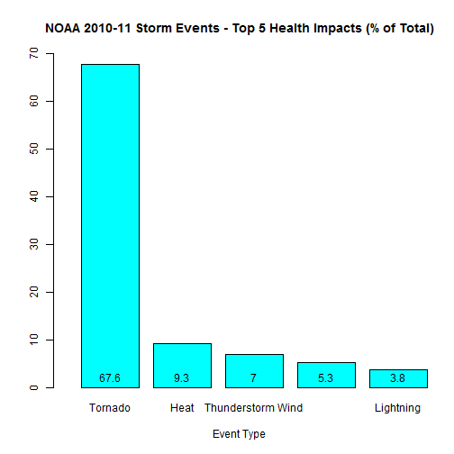
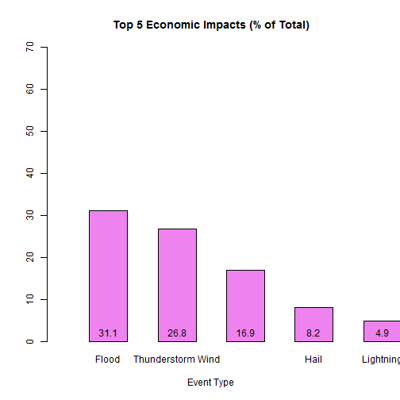

===
R markdown file name: "PA2_template.final.Rmd"
author: "MB Moran"
date: "October 25, 2014" ===

## TITLE: US Storm Database from NOAA: 
### An Exploratory Data Analysis


### TABLE OF CONTENTS:

I.   SYNOPSIS
II.  ASSIGNMENT OBJECTIVE
III. ANALYSIS OBJECTIVE
IV.  DATA PROCESSING
V.   RESULTS

### I.  SYNOPSIS:  

Extreme weather events can cause significant losses to life and property.  Tracking characteristics and outcomes of these events is of interest to many stakeholders, including individuals, communities and state and federal emergency authorities. This analysis provides one pathway to answering two broad questions for a hypothetical audience of municipal or federal emergency managers: First, which events have had the greatest population health impact, and second, which events have had the greatest economic impact? *This report shows that for the most recent years in the data set 2010-Nov 2011, Tornados were responsible for 67% of Fatalities and injuries (combined) while the event with the greatest economic impact was Floods, with 31% of total costs.*

### II. ASSIGNMENT OBJECTIVE:

The purpose of this assignment is purely educational and is part of the John Hopkin's School of Publi Health's Coursera course: Reproducable Research, October term 2014. The learning objectives are (1) Create a reproducable research report using the R markdown tool available in RStudio, which must include all R code and figures/plots and (2) Publish the markdown file (*.md) and html files which were created using the R "knitter" function in a public Rhub repository so that other students may complete a peer assessment review of the report.

INTENDED USE:
This report, code and results should not be used for any other purpose.  The report provides an illustration of how to do reproducable research and should not be relied upon as a basis for policy decisions, making predictions or drawing inferences.  The data files used, and the results presented, have not been peer reviewed or independently replicated for accuracy or reliability.

### III. ANALYSIS OBJECTIVES:

The analysis explores the National Oceanic and Atmospheric Administration's (NOAA) Storm Database. This database contains storm event information for the years 1950-(Nov)2011.  Following data processing, the analysis answers TWO specific questions in the assignment (see results section):

*(1) Across the United States, which types of weather events are most harmful to population health?*

*(2) Across the United States, which types of weather events have the greatest economic consequences?*

### IV.  DATA PROCESSING:

This assignment uses a single data source, NOAA's storm database located at:
URL: https://d396qusza40orc.cloudfront.net/repdata%2Fdata%2FStormData.csv.bz2

Full database documentation from NOAA can be found at:
URL: https://d396qusza40orc.cloudfront.net/repdata%2Fpeer2_doc%2Fpd01016005curr.pdf

and, FAQs at 
URL: https://d396qusza40orc.cloudfront.net/repdata%2Fpeer2_doc%2FNCDC%20Storm%20Events-FAQ%20Page.pdf

To meet the data processing objectives, R code was used to process the data in the following steps:
  step 4.1: Download, unzip and read the unprocessed raw data directly from the NOAA source online
  Step 4.2: Process the raw data into a format usable for the analysis and results section

#### Step 4.1: Download and Read Raw Data

```r
# Step 1 - Load required R packages, Read in raw data file, assign to data frame
#install.packages("rmarkdown")
#install.packages("knitr")
#library(lattice)
#library(knitr)
#install.packages("utility")
#library(utility)
#install.packages("agrep")

setwd("~/Actuarial/Coursera/Data Science/Reproducable Research/Assignments/Assignment 2")

sink("0-Fetch-Data.txt", split=TRUE)   # Save times, md5sum, other info in txt file
library(downloader)  # download
library(tools)       # md5sum
Sys.time()           # Start time
```

```
## [1] "2014-11-06 15:16:42 CST"
```

```r
URL <- "https://d396qusza40orc.cloudfront.net/repdata%2Fdata%2FStormData.csv.bz2"
zip.filename <- "stormdata.csv"
#download(URL, zip.filename, mode="wb")      # Download from coursera site
extracted.stormdata <- read.csv(zip.filename)  # Extract file from ZIP

mydf<-as.data.frame(extracted.stormdata)    # Assign variable myfile to the extracted file
file.info(zip.filename)                     # metadata about files
```

```
##                   size isdir mode               mtime               ctime
## stormdata.csv 49177144 FALSE  666 2014-10-22 12:32:00 2014-10-22 12:28:28
##                             atime exe
## stormdata.csv 2014-10-22 12:28:28  no
```

```r
md5sum(zip.filename)                        # Record MD5sums
```

```
##                      stormdata.csv 
## "df4aa61fff89427db6b7f7b1113b5553"
```

```r
Sys.time()           # End Time
```

```
## [1] "2014-11-06 15:19:37 CST"
```

```r
sink()
```
#### Step 4.2: Process the raw data

Check the dimensions of the downloaded raw data
View the first 5 rows, 9 columns to see if there are extra title rows before the column names
Make sure the column names are formatted correctly for R


```r
dim(mydf)
```

```
## [1] 902297     37
```

```r
head(mydf[,1:9])
```

```
##   STATE__           BGN_DATE BGN_TIME TIME_ZONE COUNTY COUNTYNAME STATE
## 1       1  4/18/1950 0:00:00     0130       CST     97     MOBILE    AL
## 2       1  4/18/1950 0:00:00     0145       CST      3    BALDWIN    AL
## 3       1  2/20/1951 0:00:00     1600       CST     57    FAYETTE    AL
## 4       1   6/8/1951 0:00:00     0900       CST     89    MADISON    AL
## 5       1 11/15/1951 0:00:00     1500       CST     43    CULLMAN    AL
## 6       1 11/15/1951 0:00:00     2000       CST     77 LAUDERDALE    AL
##    EVTYPE BGN_RANGE
## 1 TORNADO         0
## 2 TORNADO         0
## 3 TORNADO         0
## 4 TORNADO         0
## 5 TORNADO         0
## 6 TORNADO         0
```

```r
colnames(mydf)
```

```
##  [1] "STATE__"    "BGN_DATE"   "BGN_TIME"   "TIME_ZONE"  "COUNTY"    
##  [6] "COUNTYNAME" "STATE"      "EVTYPE"     "BGN_RANGE"  "BGN_AZI"   
## [11] "BGN_LOCATI" "END_DATE"   "END_TIME"   "COUNTY_END" "COUNTYENDN"
## [16] "END_RANGE"  "END_AZI"    "END_LOCATI" "LENGTH"     "WIDTH"     
## [21] "F"          "MAG"        "FATALITIES" "INJURIES"   "PROPDMG"   
## [26] "PROPDMGEXP" "CROPDMG"    "CROPDMGEXP" "WFO"        "STATEOFFIC"
## [31] "ZONENAMES"  "LATITUDE"   "LONGITUDE"  "LATITUDE_E" "LONGITUDE_"
## [36] "REMARKS"    "REFNUM"
```
Conclusion: There are no extra title rows and all column names are already formatted correctly for R. No modifications required.

#### 4.3: The columns of interest in this analysis are EVTYPE, FATALITIES, INJURIES and PROPDMG. Create summary stats

```r
summary(mydf$EVTYPE)      # Event Type
```

```
##                     HAIL                TSTM WIND        THUNDERSTORM WIND 
##                   288661                   219940                    82563 
##                  TORNADO              FLASH FLOOD                    FLOOD 
##                    60652                    54277                    25326 
##       THUNDERSTORM WINDS                HIGH WIND                LIGHTNING 
##                    20843                    20212                    15754 
##               HEAVY SNOW               HEAVY RAIN             WINTER STORM 
##                    15708                    11723                    11433 
##           WINTER WEATHER             FUNNEL CLOUD         MARINE TSTM WIND 
##                     7026                     6839                     6175 
## MARINE THUNDERSTORM WIND               WATERSPOUT              STRONG WIND 
##                     5812                     3796                     3566 
##     URBAN/SML STREAM FLD                 WILDFIRE                 BLIZZARD 
##                     3392                     2761                     2719 
##                  DROUGHT                ICE STORM           EXCESSIVE HEAT 
##                     2488                     2006                     1678 
##               HIGH WINDS         WILD/FOREST FIRE             FROST/FREEZE 
##                     1533                     1457                     1342 
##                DENSE FOG       WINTER WEATHER/MIX           TSTM WIND/HAIL 
##                     1293                     1104                     1028 
##  EXTREME COLD/WIND CHILL                     HEAT                HIGH SURF 
##                     1002                      767                      725 
##           TROPICAL STORM           FLASH FLOODING             EXTREME COLD 
##                      690                      682                      655 
##            COASTAL FLOOD         LAKE-EFFECT SNOW        FLOOD/FLASH FLOOD 
##                      650                      636                      624 
##                LANDSLIDE                     SNOW          COLD/WIND CHILL 
##                      600                      587                      539 
##                      FOG              RIP CURRENT              MARINE HAIL 
##                      538                      470                      442 
##               DUST STORM                AVALANCHE                     WIND 
##                      427                      386                      340 
##             RIP CURRENTS              STORM SURGE            FREEZING RAIN 
##                      304                      261                      250 
##              URBAN FLOOD     HEAVY SURF/HIGH SURF        EXTREME WINDCHILL 
##                      249                      228                      204 
##             STRONG WINDS           DRY MICROBURST    ASTRONOMICAL LOW TIDE 
##                      196                      186                      174 
##                HURRICANE              RIVER FLOOD               LIGHT SNOW 
##                      174                      173                      154 
##         STORM SURGE/TIDE            RECORD WARMTH         COASTAL FLOODING 
##                      148                      146                      143 
##               DUST DEVIL         MARINE HIGH WIND        UNSEASONABLY WARM 
##                      141                      135                      126 
##                 FLOODING   ASTRONOMICAL HIGH TIDE        MODERATE SNOWFALL 
##                      120                      103                      101 
##           URBAN FLOODING               WINTRY MIX        HURRICANE/TYPHOON 
##                       98                       90                       88 
##            FUNNEL CLOUDS               HEAVY SURF              RECORD HEAT 
##                       87                       84                       81 
##                   FREEZE                HEAT WAVE                     COLD 
##                       74                       74                       72 
##              RECORD COLD                      ICE  THUNDERSTORM WINDS HAIL 
##                       64                       61                       61 
##      TROPICAL DEPRESSION                    SLEET         UNSEASONABLY DRY 
##                       60                       59                       56 
##                    FROST              GUSTY WINDS      THUNDERSTORM WINDSS 
##                       53                       53                       51 
##       MARINE STRONG WIND                    OTHER               SMALL HAIL 
##                       48                       48                       47 
##                   FUNNEL             FREEZING FOG             THUNDERSTORM 
##                       46                       45                       45 
##       Temperature record          TSTM WIND (G45)         Coastal Flooding 
##                       43                       39                       38 
##              WATERSPOUTS    MONTHLY PRECIPITATION                    WINDS 
##                       37                       36                       36 
##                  (Other) 
##                     2940
```

```r
summary(mydf$FATALITIES)  # Fatalities
```

```
##     Min.  1st Qu.   Median     Mean  3rd Qu.     Max. 
##   0.0000   0.0000   0.0000   0.0168   0.0000 583.0000
```

```r
summary(mydf$INJURIES)    # Injuries
```

```
##      Min.   1st Qu.    Median      Mean   3rd Qu.      Max. 
##    0.0000    0.0000    0.0000    0.1557    0.0000 1700.0000
```

```r
summary(mydf$PROPDMG)     # Property Damage in 1000s
```

```
##    Min. 1st Qu.  Median    Mean 3rd Qu.    Max. 
##    0.00    0.00    0.00   12.06    0.50 5000.00
```

```r
summary(mydf$CROPDMG)     # Crop Damage in 1000s
```

```
##    Min. 1st Qu.  Median    Mean 3rd Qu.    Max. 
##   0.000   0.000   0.000   1.527   0.000 990.000
```
The summary stats show that there are no negative values for the analysis variables (FATALITIES, INJURIES and PROPDMG. The distribution is skewed, with mean > median and a very high max value relative to the mean. 

#### 4.4:  Missing values can cause biased results. What proportion of rows have missing data?

```r
cat('Number or rows with missing EVTYPE data= ',sum(is.na(mydf$EVTYPE)),
'Number or rows with missing FATALITIES data= ',sum(is.na(mydf$FATALITIES)),
'Number or rows with missing INJURIES data= ',sum(is.na(mydf$INJURIES)),
'Number or rows with missing PROPDMG data= ',sum(is.na(mydf$PROPDMG)),
'Number or rows with missing CROPDMG data= ',sum(is.na(mydf$CROPDMG)))
```

```
## Number or rows with missing EVTYPE data=  0 Number or rows with missing FATALITIES data=  0 Number or rows with missing INJURIES data=  0 Number or rows with missing PROPDMG data=  0 Number or rows with missing CROPDMG data=  0
```
Great! No missing values

#### 4.5 How many unique Weather event types are there in column EVTYPE? 
Clean the raw data and determine a methodology for grouping events into 48 unique types as outlined in the NOAA dataset documentation.

##### 4.5.1 First, create smaller data frame containing only columns which have at least one non zero analysis variable. 
Rationale: Smaller datasets are easier to tidy up and take less processing time


```r
keeprows<-ifelse(mydf$FATALITIES !=0 | mydf$INJURIES != 0 | mydf$PROPDMG !=0 | mydf$CROPDMG !=0,TRUE,FALSE)
mydf2<-mydf[keeprows,c("BGN_DATE","EVTYPE","FATALITIES","INJURIES","PROPDMG","CROPDMG")]
```

##### 4.5.2 Next, create EVTYPE.TIDY column by removing spaces and brackets() and making every letter uppercase


```r
mydf2$EVTYPE.TIDY<-gsub("[[:punct:]]", "", mydf2$EVTYPE)
mydf2$EVTYPE.TIDY<-toupper(gsub(" ", "", mydf2$EVTYPE.TIDY))
rownames(mydf2)<-NULL

# Count and report how many unique event types there were in the raw data vs the tidy data
mydf$Count<-1
mydf2$Count<-1
EVTYPE.RAW1 <- aggregate(mydf[c("Count")], by=list(mydf$EVTYPE), FUN=sum, na.rm=TRUE)
EVTYPE.RAW2 <- aggregate(mydf2[c("Count")], by=list(mydf2$EVTYPE), FUN=sum, na.rm=TRUE)
EVTYPE.TIDY <- aggregate(mydf2[c("Count")], by=list(mydf2$EVTYPE.TIDY), FUN=sum, na.rm=TRUE)
nrow1<-nrow(EVTYPE.RAW1)
nrow2<-nrow(EVTYPE.RAW2)
nrowtidy<-nrow(EVTYPE.TIDY)
cat('Therefore, by tidying up the data we went from having to deal with ',nrow1,' values for EVTYPE in the downloaded raw data to ',nrow2,' in the step which removed the zero analysis variables to ',nrowtidy,' in the final tidy step which removed blanks, special characters and made it upper case.')
```

```
## Therefore, by tidying up the data we went from having to deal with  985  values for EVTYPE in the downloaded raw data to  488  in the step which removed the zero analysis variables to  408  in the final tidy step which removed blanks, special characters and made it upper case.
```

#### 4.6 Next, find the closest match between the events in the tidy data set and the 48 NOAA events.


```r
GROUPS.EVTYPE.VECTOR<-c(
"Astronomical Low Tide",
"Avalanche",
"Blizzard",
"Coastal Flood",
"Cold/Wind Chill",
"Debris Flow",
"Dense Fog",
"Dense Smoke",
"Drought",
"Dust Devil",
"Dust Storm",
"Excessive Heat",
"Extreme Cold/Wind Chill",
"Flash Flood",
"Flood",
"Freezing Fog",
"Frost/Freeze",
"Funnel Cloud",
"Hail",
"Heat",
"Heavy Rain",
"Heavy Snow",
"High Surf",
"High Wind",
"Hurricane/Typhoon",
"Ice Storm",
"Lakeshore Flood",
"Lake-Effect Snow",
"Lightning",
"Marine Hail",
"Marine High Wind",
"Marine Strong Wind",
"Marine Thunderstorm Wind",
"Rip Current",
"Seiche",
"Sleet",
"Storm Tide",
"Strong Wind",
"Thunderstorm Wind",
"Tornado",
"Tropical Depression",
"Tropical Storm",
"Tsunami",
"Volcanic Ash",
"Waterspout",
"Wildfire",
"Winter Storm",
"Winter Weather")

GROUPS.EVTYPE.TIDY<-gsub("[[:punct:]]", "", GROUPS.EVTYPE.VECTOR)
GROUPS.EVTYPE.TIDY<-toupper(gsub(" ", "",GROUPS.EVTYPE.TIDY))
GROUPS.EVTYPE<-cbind(GROUPS.EVTYPE.VECTOR,GROUPS.EVTYPE.TIDY)
GROUPS.EVTYPE<-as.data.frame(GROUPS.EVTYPE)

mydf2$type<-as.character('Other')
GROUPS.EVTYPE$GROUPS.EVTYPE.VECTOR<-as.character(GROUPS.EVTYPE$GROUPS.EVTYPE.VECTOR)

for(i in 1:nrow(GROUPS.EVTYPE)) {
    GROUPS.EVTYPE.PATTERN<-as.character(GROUPS.EVTYPE$GROUPS.EVTYPE.TIDY[i])
    
    EVTYPE.MATCH<-as.numeric(agrep(pattern=GROUPS.EVTYPE.PATTERN,x=mydf2$EVTYPE.TIDY,max.distance=0.1,ignore.case=FALSE,value=FALSE,fixed=FALSE))

    mydf2$type[EVTYPE.MATCH] <- GROUPS.EVTYPE$GROUPS.EVTYPE.VECTOR[i]

}
# After inspecting the dataset, Manually change the type for the largest EVTYPE missing a match
mydf2$type[which(mydf2$EVTYPE.TIDY=="TSTMWIND")]<-"Thunderstorm Wind"


# check the number of event types in mydf2 which matched and if any are still missing?
EVTYPE.TYPE <- as.data.frame(aggregate(mydf2[c("Count")], by=list(mydf2$type), FUN=sum, na.rm=TRUE))

mydf2.missing<-as.data.frame(mydf2[which(mydf2$type=='Other'),])
EVTYPE.MISSING<- as.data.frame(aggregate(mydf2.missing[c("Count")], by=list(mydf2.missing$EVTYPE.TIDY), FUN=sum, na.rm=TRUE))

cat('The number of records with EVTYPE unmatched is ',EVTYPE.TYPE$Count[which(EVTYPE.TYPE$Group.1=='Other')],' and the number of event types unmatched is ',nrow(EVTYPE.MISSING))
```

```
## The number of records with EVTYPE unmatched is  2749  and the number of event types unmatched is  161
```

```r
pcterror<-EVTYPE.TYPE$Count[which(EVTYPE.TYPE$Group.1=='Other')]/nrow(mydf2)
percent <- function(x, digits = 2, format = "f", ...) {
  paste0(formatC(100 * x, format = format, digits = digits, ...), "%")
}
cat('The number of records with missing event group is now ',EVTYPE.TYPE$Count[which(EVTYPE.TYPE$Group.1=='Other')], ' or ', percent(pcterror),' of the tidy data set records ', nrow(mydf2))
```

```
## The number of records with missing event group is now  2749  or  1.08%  of the tidy data set records  254633
```
#### 4.7 Final Data Processing Step - Create Tidy Data Set Summarized for the results and analysis


```r
mydf2$pophealth<- mydf2$FATALITIES + mydf2$INJURIES
mydf2$econdamage<-mydf2$PROPDMG + mydf2$CROPDMG
mydf2$BGN_YEAR<-format(as.Date(as.character(mydf2$BGN_DATE),format='%m/%d/%Y'),"%Y")

mydf3<-as.data.frame(aggregate(mydf2[c("FATALITIES","INJURIES","PROPDMG","CROPDMG","pophealth","econdamage")], by=list(mydf2$type,mydf2$BGN_YEAR), FUN=sum, na.rm=TRUE))
colnames(mydf3)<-c('type','BGN_YEAR','FATALITIES','INJURIES','PROPDMG','CROPDMG','pophealth','econdamage')
```

### V.  RESULTS:

This section provides an answer to each of the two analysis questions with supporting code steps and figures. For context, this report is written for a hypothetical audience of government or municipal managers who may be responsible for managing responses and outcomes from current or future extreme weather events.  The perspective of the audience is an important factor in determining how to summarize the data and what time periods are most relevant. Because managers are likely to be most concerned about recent years, and because it is known that the raw data from NOAA have inconsistent exposures of geographic locations and number of activity monitors over time, using either an aggregate 1950-2011 summary or a trend analysis approach may produce biased results and does not seem appropriate. However, reporting only the latest year has a disadvantage of volatility. Therefore, this analysis uses a compromise approach, providing results in 10 year groupings.

Definitions: 

a.  Population Health is defined as the number of lives that experienced either a fatality or an injury
b.  Economic Damage is defined as the monetary sum in $USD (1000s) of property damage and crop damage.

**Question 1: Across the United States, which types of weather events are most harmful to population health?**


```r
if (!require("xtable")) {
  install.packages("xtable", repos="http://cran.rstudio.com/") 
  library("xtable")
}
```

```
## Loading required package: xtable
```

```r
if (!require("reshape2")) {
  install.packages("reshape2", repos="http://cran.rstudio.com/") 
  library("reshape2")
}
```

```
## Loading required package: reshape2
```

```r
mydf3$BGN_YEAR_DECADE<-trunc((as.numeric(mydf3$BGN_YEAR)-1900)/10)*10+1900

xagg<-as.data.frame(aggregate(mydf3[c("pophealth","econdamage")], by=list(mydf3$type,mydf3$BGN_YEAR_DECADE), FUN=sum, na.rm=TRUE))
colnames(xagg)<-c('type','BGN_YEAR_DECADE','pophealth','econdamage')

xmelt <- melt(xagg, id.vars = c('BGN_YEAR_DECADE','type'),measure.vars='pophealth',value.name='pophealth')
xcast<-dcast(xmelt, type ~ BGN_YEAR_DECADE, value.var = "pophealth",drop=FALSE,fill=0)

colnames(xcast)<-c('Event.Type','The.50s','The.60s','The.70s','The.80s','The.90s','The.2000s','For.2010.11')

xcast.sort<-xcast[order(xcast$For.2010-11,xcast$The.2000s,xcast$The.90s,xcast$The.80s,xcast$The.70s,xcast$The.60s,xcast$The.50s,decreasing=TRUE),]

xcast.sort$The.50s<-format(round(xcast.sort$The.50s,0),big.mark=",",scientific=F,nsmall=0)
xcast.sort$The.60s<-format(round(xcast.sort$The.60s,0),big.mark=",",scientific=F,nsmall=0)
xcast.sort$The.70s<-format(round(xcast.sort$The.70s,0),big.mark=",",scientific=F,nsmall=0)
xcast.sort$The.80s<-format(round(xcast.sort$The.80s,0),big.mark=",",scientific=F,nsmall=0)
xcast.sort$The.90s<-format(round(xcast.sort$The.90s,0),big.mark=",",scientific=F,nsmall=0)
xcast.sort$The.2000s<-format(round(xcast.sort$The.2000s,0),big.mark=",",scientific=F,nsmall=0)
xcast.sort$For.2010.11 <- format(round(xcast.sort$For.2010.11,0),big.mark=",",scientific=F,nsmall=0)

row.names(xcast.sort)<-NULL

# print table 1
rws <- seq(from=1,to=(nrow(xcast.sort)), by=2)
col <- rep("\\rowcolor[gray]{0.95}",length(rws))

print("Table 1: NOAA Storm Database 1950-Nov 2011, Events with Biggest Impact on Population Health
Sorted Descending number of lives affected in 2010-11",quote=FALSE)
```

[1] Table 1: NOAA Storm Database 1950-Nov 2011, Events with Biggest Impact on Population Health\nSorted Descending number of lives affected in 2010-11

```r
print(xtable(xcast.sort),booktabs=TRUE,add.to.row=list(pos=as.list(rws),command=col),type='html',comment=FALSE)
```

<table border=1>
<tr> <th>  </th> <th> Event.Type </th> <th> The.50s </th> <th> The.60s </th> <th> The.70s </th> <th> The.80s </th> <th> The.90s </th> <th> The.2000s </th> <th> For.2010.11 </th>  </tr>
 <tr> <td align="right"> 1 </td> <td> Tornado </td> <td> 15,889 </td> <td> 18,207 </td> <td> 22,638 </td> <td> 11,819 </td> <td> 12,063 </td> <td> 8,912 </td> <td> 7,494 </td> </tr>
   \rowcolor[gray]{0.95}<tr> <td align="right"> 2 </td> <td> Heat </td> <td>      0 </td> <td>      0 </td> <td>      0 </td> <td>      0 </td> <td>  6,217 </td> <td> 5,176 </td> <td> 1,033 </td> </tr>
  <tr> <td align="right"> 3 </td> <td> Thunderstorm Wind </td> <td>      0 </td> <td>      0 </td> <td>      0 </td> <td>  2,112 </td> <td>  4,563 </td> <td> 2,652 </td> <td>   784 </td> </tr>
   \rowcolor[gray]{0.95}<tr> <td align="right"> 4 </td> <td> Flood </td> <td>      0 </td> <td>      0 </td> <td>      0 </td> <td>      0 </td> <td>  8,127 </td> <td> 1,408 </td> <td>   591 </td> </tr>
  <tr> <td align="right"> 5 </td> <td> Lightning </td> <td>      0 </td> <td>      0 </td> <td>      0 </td> <td>      0 </td> <td>  2,589 </td> <td> 3,028 </td> <td>   431 </td> </tr>
   \rowcolor[gray]{0.95}<tr> <td align="right"> 6 </td> <td> Rip Current </td> <td>      0 </td> <td>      0 </td> <td>      0 </td> <td>      0 </td> <td>    261 </td> <td>   695 </td> <td>   150 </td> </tr>
  <tr> <td align="right"> 7 </td> <td> Wildfire </td> <td>      0 </td> <td>      0 </td> <td>      0 </td> <td>      0 </td> <td>    415 </td> <td> 1,133 </td> <td>   148 </td> </tr>
   \rowcolor[gray]{0.95}<tr> <td align="right"> 8 </td> <td> Hail </td> <td>      0 </td> <td>      0 </td> <td>      0 </td> <td>    222 </td> <td>    693 </td> <td>   723 </td> <td>   126 </td> </tr>
  <tr> <td align="right"> 9 </td> <td> Strong Wind </td> <td>      0 </td> <td>      0 </td> <td>      0 </td> <td>      0 </td> <td>     46 </td> <td>   314 </td> <td>    88 </td> </tr>
   \rowcolor[gray]{0.95}<tr> <td align="right"> 10 </td> <td> Avalanche </td> <td>      0 </td> <td>      0 </td> <td>      0 </td> <td>      0 </td> <td>     90 </td> <td>   246 </td> <td>    59 </td> </tr>
  <tr> <td align="right"> 11 </td> <td> High Surf </td> <td>      0 </td> <td>      0 </td> <td>      0 </td> <td>      0 </td> <td>     49 </td> <td>   242 </td> <td>    59 </td> </tr>
   \rowcolor[gray]{0.95}<tr> <td align="right"> 12 </td> <td> High Wind </td> <td>      0 </td> <td>      0 </td> <td>      0 </td> <td>      0 </td> <td>    996 </td> <td>   769 </td> <td>    39 </td> </tr>
  <tr> <td align="right"> 13 </td> <td> Heavy Snow </td> <td>      0 </td> <td>      0 </td> <td>      0 </td> <td>      0 </td> <td>    814 </td> <td>   327 </td> <td>    20 </td> </tr>
   \rowcolor[gray]{0.95}<tr> <td align="right"> 14 </td> <td> Winter Storm </td> <td>      0 </td> <td>      0 </td> <td>      0 </td> <td>      0 </td> <td>  1,030 </td> <td>   529 </td> <td>    11 </td> </tr>
  <tr> <td align="right"> 15 </td> <td> Winter Weather </td> <td>      0 </td> <td>      0 </td> <td>      0 </td> <td>      0 </td> <td>     55 </td> <td>   534 </td> <td>    10 </td> </tr>
   \rowcolor[gray]{0.95}<tr> <td align="right"> 16 </td> <td> Heavy Rain </td> <td>      0 </td> <td>      0 </td> <td>      0 </td> <td>      0 </td> <td>    150 </td> <td>   195 </td> <td>     9 </td> </tr>
  <tr> <td align="right"> 17 </td> <td> Dust Devil </td> <td>      0 </td> <td>      0 </td> <td>      0 </td> <td>      0 </td> <td>      7 </td> <td>    30 </td> <td>     8 </td> </tr>
   \rowcolor[gray]{0.95}<tr> <td align="right"> 18 </td> <td> Tropical Storm </td> <td>      0 </td> <td>      0 </td> <td>      0 </td> <td>      0 </td> <td>    132 </td> <td>   312 </td> <td>     5 </td> </tr>
  <tr> <td align="right"> 19 </td> <td> Dust Storm </td> <td>      0 </td> <td>      0 </td> <td>      0 </td> <td>      0 </td> <td>    209 </td> <td>   249 </td> <td>     4 </td> </tr>
   \rowcolor[gray]{0.95}<tr> <td align="right"> 20 </td> <td> Blizzard </td> <td>      0 </td> <td>      0 </td> <td>      0 </td> <td>      0 </td> <td>    864 </td> <td>    40 </td> <td>     2 </td> </tr>
  <tr> <td align="right"> 21 </td> <td> Other </td> <td>      0 </td> <td>      0 </td> <td>      0 </td> <td>      0 </td> <td>  2,065 </td> <td>   734 </td> <td>     1 </td> </tr>
   \rowcolor[gray]{0.95}<tr> <td align="right"> 22 </td> <td> Tsunami </td> <td>      0 </td> <td>      0 </td> <td>      0 </td> <td>      0 </td> <td>      0 </td> <td>   161 </td> <td>     1 </td> </tr>
  <tr> <td align="right"> 23 </td> <td> Ice Storm </td> <td>      0 </td> <td>      0 </td> <td>      0 </td> <td>      0 </td> <td>  1,936 </td> <td>   144 </td> <td>     1 </td> </tr>
   \rowcolor[gray]{0.95}<tr> <td align="right"> 24 </td> <td> Hurricane/Typhoon </td> <td>      0 </td> <td>      0 </td> <td>      0 </td> <td>      0 </td> <td>      0 </td> <td> 1,339 </td> <td>     0 </td> </tr>
  <tr> <td align="right"> 25 </td> <td> Dense Fog </td> <td>      0 </td> <td>      0 </td> <td>      0 </td> <td>      0 </td> <td>    208 </td> <td>   152 </td> <td>     0 </td> </tr>
   \rowcolor[gray]{0.95}<tr> <td align="right"> 26 </td> <td> Drought </td> <td>      0 </td> <td>      0 </td> <td>      0 </td> <td>      0 </td> <td>      0 </td> <td>     4 </td> <td>     0 </td> </tr>
  <tr> <td align="right"> 27 </td> <td> Waterspout </td> <td>      0 </td> <td>      0 </td> <td>      0 </td> <td>      0 </td> <td>     75 </td> <td>     3 </td> <td>     0 </td> </tr>
   \rowcolor[gray]{0.95}<tr> <td align="right"> 28 </td> <td> Marine High Wind </td> <td>      0 </td> <td>      0 </td> <td>      0 </td> <td>      0 </td> <td>      0 </td> <td>     2 </td> <td>     0 </td> </tr>
  <tr> <td align="right"> 29 </td> <td> Funnel Cloud </td> <td>      0 </td> <td>      0 </td> <td>      0 </td> <td>      0 </td> <td>      3 </td> <td>     0 </td> <td>     0 </td> </tr>
   \rowcolor[gray]{0.95}<tr> <td align="right"> 30 </td> <td> Sleet </td> <td>      0 </td> <td>      0 </td> <td>      0 </td> <td>      0 </td> <td>      2 </td> <td>     0 </td> <td>     0 </td> </tr>
  <tr> <td align="right"> 31 </td> <td> Astronomical Low Tide </td> <td>      0 </td> <td>      0 </td> <td>      0 </td> <td>      0 </td> <td>      0 </td> <td>     0 </td> <td>     0 </td> </tr>
   \rowcolor[gray]{0.95}<tr> <td align="right"> 32 </td> <td> Dense Smoke </td> <td>      0 </td> <td>      0 </td> <td>      0 </td> <td>      0 </td> <td>      0 </td> <td>     0 </td> <td>     0 </td> </tr>
  <tr> <td align="right"> 33 </td> <td> Excessive Heat </td> <td>      0 </td> <td>      0 </td> <td>      0 </td> <td>      0 </td> <td>      0 </td> <td>     0 </td> <td>     0 </td> </tr>
   \rowcolor[gray]{0.95}<tr> <td align="right"> 34 </td> <td> Freezing Fog </td> <td>      0 </td> <td>      0 </td> <td>      0 </td> <td>      0 </td> <td>      0 </td> <td>     0 </td> <td>     0 </td> </tr>
  <tr> <td align="right"> 35 </td> <td> Frost/Freeze </td> <td>      0 </td> <td>      0 </td> <td>      0 </td> <td>      0 </td> <td>      0 </td> <td>     0 </td> <td>     0 </td> </tr>
   \rowcolor[gray]{0.95}<tr> <td align="right"> 36 </td> <td> Lake-Effect Snow </td> <td>      0 </td> <td>      0 </td> <td>      0 </td> <td>      0 </td> <td>      0 </td> <td>     0 </td> <td>     0 </td> </tr>
  <tr> <td align="right"> 37 </td> <td> Lakeshore Flood </td> <td>      0 </td> <td>      0 </td> <td>      0 </td> <td>      0 </td> <td>      0 </td> <td>     0 </td> <td>     0 </td> </tr>
   \rowcolor[gray]{0.95}<tr> <td align="right"> 38 </td> <td> Marine Hail </td> <td>      0 </td> <td>      0 </td> <td>      0 </td> <td>      0 </td> <td>      0 </td> <td>     0 </td> <td>     0 </td> </tr>
  <tr> <td align="right"> 39 </td> <td> Seiche </td> <td>      0 </td> <td>      0 </td> <td>      0 </td> <td>      0 </td> <td>      0 </td> <td>     0 </td> <td>     0 </td> </tr>
   \rowcolor[gray]{0.95}<tr> <td align="right"> 40 </td> <td> Tropical Depression </td> <td>      0 </td> <td>      0 </td> <td>      0 </td> <td>      0 </td> <td>      0 </td> <td>     0 </td> <td>     0 </td> </tr>
  <tr> <td align="right"> 41 </td> <td> Volcanic Ash </td> <td>      0 </td> <td>      0 </td> <td>      0 </td> <td>      0 </td> <td>      0 </td> <td>     0 </td> <td>     0 </td> </tr>
   \rowcolor[gray]{0.95}</table>

```r
#capture.output(print(xtable(xcast.sort),booktabs=TRUE,add.to.row=list(pos=as.list(rws),command=col)),file="table1.png")

cat('Answer:  The event type with the biggest impact on population health, for each decade in the study, is ',xcast.sort$Event.Type[1])
```

Answer:  The event type with the biggest impact on population health, for each decade in the study, is  Tornado

**Question 2: Across the United States, which types of weather events have the greatest economic consequences?**


```r
#install.packages("xtable")
#library(xtable)
#library(reshape2)

if (!require("xtable")) {
  install.packages("xtable", repos="http://cran.rstudio.com/") 
  library("xtable")
}
if (!require("reshape2")) {
  install.packages("reshape2", repos="http://cran.rstudio.com/") 
  library("reshape2")
}

ymelt <- melt(xagg, id.vars = c('BGN_YEAR_DECADE','type'),measure.vars='econdamage',value.name='econdamage')
ycast<-dcast(ymelt, type ~ BGN_YEAR_DECADE, value.var = "econdamage",drop=FALSE,fill=0)

colnames(ycast)<-c('Event.Type','The.50s','The.60s','The.70s','The.80s','The.90s','The.2000s','For.2010.11')

ycast.sort<-ycast[order(ycast$For.2010.11,xcast$The.2000s,xcast$The.90s,xcast$The.80s,xcast$The.70s,xcast$The.60s,xcast$The.50s,decreasing=TRUE),]

ycast.sort$The.50s<-format(round(ycast.sort$The.50s,0),big.mark=",",scientific=F,nsmall=0)
ycast.sort$The.60s<-format(round(ycast.sort$The.60s,0),big.mark=",",scientific=F,nsmall=0)
ycast.sort$The.70s<-format(round(ycast.sort$The.70s,0),big.mark=",",scientific=F,nsmall=0)
ycast.sort$The.80s<-format(round(ycast.sort$The.80s,0),big.mark=",",scientific=F,nsmall=0)
ycast.sort$The.90s<-format(round(ycast.sort$The.90s,0),big.mark=",",scientific=F,nsmall=0)
ycast.sort$The.2000s<-format(round(ycast.sort$The.2000s,0),big.mark=",",scientific=F,nsmall=0)
ycast.sort$For.2010.11 <- format(round(ycast.sort$For.2010.11,0),big.mark=",",scientific=F,nsmall=0)

row.names(ycast.sort)<-NULL

# print table 2
rws <- seq(from=1,to=(nrow(ycast.sort)), by=2)
col <- rep("\\rowcolor[gray]{0.95}",length(rws))

print("Table 2: NOAA Storm Database 1950-Nov 2011, Events with Biggest Economic Impact, Property + Crop Damage, by Descending Total Costs in 2010-11(Nov) in $000s USD",quote=FALSE)
```

[1] Table 2: NOAA Storm Database 1950-Nov 2011, Events with Biggest Economic Impact, Property + Crop Damage, by Descending Total Costs in 2010-11(Nov) in $000s USD

```r
print(xtable(ycast.sort),booktabs=TRUE,add.to.row=list(pos=as.list(rws),command=col),type='html',comment=FALSE)
```

<table border=1>
<tr> <th>  </th> <th> Event.Type </th> <th> The.50s </th> <th> The.60s </th> <th> The.70s </th> <th> The.80s </th> <th> The.90s </th> <th> The.2000s </th> <th> For.2010.11 </th>  </tr>
 <tr> <td align="right"> 1 </td> <td> Flood </td> <td>       0 </td> <td>       0 </td> <td>       0 </td> <td>       0 </td> <td>   863,878 </td> <td> 1,444,788 </td> <td> 489,452 </td> </tr>
   \rowcolor[gray]{0.95}<tr> <td align="right"> 2 </td> <td> Thunderstorm Wind </td> <td>       0 </td> <td>       0 </td> <td>       0 </td> <td>       0 </td> <td> 1,065,418 </td> <td> 1,372,748 </td> <td> 421,954 </td> </tr>
  <tr> <td align="right"> 3 </td> <td> Tornado </td> <td> 237,689 </td> <td> 328,469 </td> <td> 512,158 </td> <td> 545,208 </td> <td>   710,291 </td> <td>   713,960 </td> <td> 266,787 </td> </tr>
   \rowcolor[gray]{0.95}<tr> <td align="right"> 4 </td> <td> Hail </td> <td>       0 </td> <td>       0 </td> <td>       0 </td> <td>       0 </td> <td>   464,901 </td> <td>   695,694 </td> <td> 129,601 </td> </tr>
  <tr> <td align="right"> 5 </td> <td> Lightning </td> <td>       0 </td> <td>       0 </td> <td>       0 </td> <td>       0 </td> <td>   209,798 </td> <td>   318,915 </td> <td>  78,382 </td> </tr>
   \rowcolor[gray]{0.95}<tr> <td align="right"> 6 </td> <td> Wildfire </td> <td>       0 </td> <td>       0 </td> <td>       0 </td> <td>       0 </td> <td>    21,819 </td> <td>    73,414 </td> <td>  38,981 </td> </tr>
  <tr> <td align="right"> 7 </td> <td> High Wind </td> <td>       0 </td> <td>       0 </td> <td>       0 </td> <td>       0 </td> <td>   144,567 </td> <td>   225,935 </td> <td>  33,103 </td> </tr>
   \rowcolor[gray]{0.95}<tr> <td align="right"> 8 </td> <td> Winter Storm </td> <td>       0 </td> <td>       0 </td> <td>       0 </td> <td>       0 </td> <td>    39,018 </td> <td>    76,613 </td> <td>  21,134 </td> </tr>
  <tr> <td align="right"> 9 </td> <td> Strong Wind </td> <td>       0 </td> <td>       0 </td> <td>       0 </td> <td>       0 </td> <td>     1,975 </td> <td>    48,022 </td> <td>  16,276 </td> </tr>
   \rowcolor[gray]{0.95}<tr> <td align="right"> 10 </td> <td> Tropical Storm </td> <td>       0 </td> <td>       0 </td> <td>       0 </td> <td>       0 </td> <td>     8,030 </td> <td>    35,337 </td> <td>  13,031 </td> </tr>
  <tr> <td align="right"> 11 </td> <td> Heavy Snow </td> <td>       0 </td> <td>       0 </td> <td>       0 </td> <td>       0 </td> <td>    61,676 </td> <td>    55,811 </td> <td>   9,194 </td> </tr>
   \rowcolor[gray]{0.95}<tr> <td align="right"> 12 </td> <td> Other </td> <td>       0 </td> <td>       0 </td> <td>       0 </td> <td>       0 </td> <td>   104,778 </td> <td>    58,923 </td> <td>   8,445 </td> </tr>
  <tr> <td align="right"> 13 </td> <td> Ice Storm </td> <td>       0 </td> <td>       0 </td> <td>       0 </td> <td>       0 </td> <td>    26,599 </td> <td>    34,430 </td> <td>   7,261 </td> </tr>
   \rowcolor[gray]{0.95}<tr> <td align="right"> 14 </td> <td> Heavy Rain </td> <td>       0 </td> <td>       0 </td> <td>       0 </td> <td>       0 </td> <td>    18,609 </td> <td>    42,112 </td> <td>   6,448 </td> </tr>
  <tr> <td align="right"> 15 </td> <td> Lake-Effect Snow </td> <td>       0 </td> <td>       0 </td> <td>       0 </td> <td>       0 </td> <td>        60 </td> <td>     7,879 </td> <td>   6,269 </td> </tr>
   \rowcolor[gray]{0.95}<tr> <td align="right"> 16 </td> <td> Drought </td> <td>       0 </td> <td>       0 </td> <td>       0 </td> <td>       0 </td> <td>     7,305 </td> <td>    24,466 </td> <td>   6,226 </td> </tr>
  <tr> <td align="right"> 17 </td> <td> Waterspout </td> <td>       0 </td> <td>       0 </td> <td>       0 </td> <td>       0 </td> <td>     5,472 </td> <td>       197 </td> <td>   5,111 </td> </tr>
   \rowcolor[gray]{0.95}<tr> <td align="right"> 18 </td> <td> Winter Weather </td> <td>       0 </td> <td>       0 </td> <td>       0 </td> <td>       0 </td> <td>        19 </td> <td>    12,539 </td> <td>   4,366 </td> </tr>
  <tr> <td align="right"> 19 </td> <td> Blizzard </td> <td>       0 </td> <td>       0 </td> <td>       0 </td> <td>       0 </td> <td>     9,367 </td> <td>    12,344 </td> <td>   3,880 </td> </tr>
   \rowcolor[gray]{0.95}<tr> <td align="right"> 20 </td> <td> Heat </td> <td>       0 </td> <td>       0 </td> <td>       0 </td> <td>       0 </td> <td>     5,608 </td> <td>     1,480 </td> <td>   1,333 </td> </tr>
  <tr> <td align="right"> 21 </td> <td> Frost/Freeze </td> <td>       0 </td> <td>       0 </td> <td>       0 </td> <td>       0 </td> <td>       601 </td> <td>     6,782 </td> <td>   1,221 </td> </tr>
   \rowcolor[gray]{0.95}<tr> <td align="right"> 22 </td> <td> Dense Fog </td> <td>       0 </td> <td>       0 </td> <td>       0 </td> <td>       0 </td> <td>     2,355 </td> <td>     4,733 </td> <td>   1,137 </td> </tr>
  <tr> <td align="right"> 23 </td> <td> Dust Storm </td> <td>       0 </td> <td>       0 </td> <td>       0 </td> <td>       0 </td> <td>     1,320 </td> <td>     4,343 </td> <td>     988 </td> </tr>
   \rowcolor[gray]{0.95}<tr> <td align="right"> 24 </td> <td> Tsunami </td> <td>       0 </td> <td>       0 </td> <td>       0 </td> <td>       0 </td> <td>         0 </td> <td>       113 </td> <td>     812 </td> </tr>
  <tr> <td align="right"> 25 </td> <td> High Surf </td> <td>       0 </td> <td>       0 </td> <td>       0 </td> <td>       0 </td> <td>     1,470 </td> <td>     3,082 </td> <td>     462 </td> </tr>
   \rowcolor[gray]{0.95}<tr> <td align="right"> 26 </td> <td> Avalanche </td> <td>       0 </td> <td>       0 </td> <td>       0 </td> <td>       0 </td> <td>       200 </td> <td>     1,167 </td> <td>     257 </td> </tr>
  <tr> <td align="right"> 27 </td> <td> Freezing Fog </td> <td>       0 </td> <td>       0 </td> <td>       0 </td> <td>       0 </td> <td>         0 </td> <td>         2 </td> <td>     182 </td> </tr>
   \rowcolor[gray]{0.95}<tr> <td align="right"> 28 </td> <td> Dust Devil </td> <td>       0 </td> <td>       0 </td> <td>       0 </td> <td>       0 </td> <td>       111 </td> <td>       514 </td> <td>      94 </td> </tr>
  <tr> <td align="right"> 29 </td> <td> Funnel Cloud </td> <td>       0 </td> <td>       0 </td> <td>       0 </td> <td>       0 </td> <td>       114 </td> <td>        40 </td> <td>      40 </td> </tr>
   \rowcolor[gray]{0.95}<tr> <td align="right"> 30 </td> <td> Marine High Wind </td> <td>       0 </td> <td>       0 </td> <td>       0 </td> <td>       0 </td> <td>         0 </td> <td>       267 </td> <td>      31 </td> </tr>
  <tr> <td align="right"> 31 </td> <td> Lakeshore Flood </td> <td>       0 </td> <td>       0 </td> <td>       0 </td> <td>       0 </td> <td>         0 </td> <td>        40 </td> <td>       8 </td> </tr>
   \rowcolor[gray]{0.95}<tr> <td align="right"> 32 </td> <td> Hurricane/Typhoon </td> <td>       0 </td> <td>       0 </td> <td>       0 </td> <td>       0 </td> <td>         0 </td> <td>    10,638 </td> <td>       0 </td> </tr>
  <tr> <td align="right"> 33 </td> <td> Rip Current </td> <td>       0 </td> <td>       0 </td> <td>       0 </td> <td>       0 </td> <td>         2 </td> <td>       161 </td> <td>       0 </td> </tr>
   \rowcolor[gray]{0.95}<tr> <td align="right"> 34 </td> <td> Sleet </td> <td>       0 </td> <td>       0 </td> <td>       0 </td> <td>       0 </td> <td>       701 </td> <td>         0 </td> <td>       0 </td> </tr>
  <tr> <td align="right"> 35 </td> <td> Astronomical Low Tide </td> <td>       0 </td> <td>       0 </td> <td>       0 </td> <td>       0 </td> <td>         0 </td> <td>       320 </td> <td>       0 </td> </tr>
   \rowcolor[gray]{0.95}<tr> <td align="right"> 36 </td> <td> Dense Smoke </td> <td>       0 </td> <td>       0 </td> <td>       0 </td> <td>       0 </td> <td>         0 </td> <td>       100 </td> <td>       0 </td> </tr>
  <tr> <td align="right"> 37 </td> <td> Excessive Heat </td> <td>       0 </td> <td>       0 </td> <td>       0 </td> <td>       0 </td> <td>       142 </td> <td>         0 </td> <td>       0 </td> </tr>
   \rowcolor[gray]{0.95}<tr> <td align="right"> 38 </td> <td> Marine Hail </td> <td>       0 </td> <td>       0 </td> <td>       0 </td> <td>       0 </td> <td>         0 </td> <td>         4 </td> <td>       0 </td> </tr>
  <tr> <td align="right"> 39 </td> <td> Seiche </td> <td>       0 </td> <td>       0 </td> <td>       0 </td> <td>       0 </td> <td>       770 </td> <td>       210 </td> <td>       0 </td> </tr>
   \rowcolor[gray]{0.95}<tr> <td align="right"> 40 </td> <td> Tropical Depression </td> <td>       0 </td> <td>       0 </td> <td>       0 </td> <td>       0 </td> <td>         0 </td> <td>       738 </td> <td>       0 </td> </tr>
  <tr> <td align="right"> 41 </td> <td> Volcanic Ash </td> <td>       0 </td> <td>       0 </td> <td>       0 </td> <td>       0 </td> <td>         0 </td> <td>       500 </td> <td>       0 </td> </tr>
   \rowcolor[gray]{0.95}</table>

```r
capture.output(print(xtable(ycast.sort),booktabs=TRUE,add.to.row=list(pos=as.list(rws),command=col)),file="table2.png")

cat('Answer:  The event type with the biggest economic impact, from 2000 and later in the study, is ',ycast.sort$Event.Type[1])
```

Answer:  The event type with the biggest economic impact, from 2000 and later in the study, is  Flood

**Some Observations about Tables 1 and 2:**

1.  Many of the NOAA event types were not coded in the 1950s-80s. Less than 4 of the 48 categories were used in the first 4 decades.

2.  The 'Other' event type category was defined within this analysis and was not one of the NOAA 48 event codes. The event types which were allocated into the 'Other' bucket represent insignificant values from the 1990s forward.  Because this study places more weight on the 2000+ data, the 'Other' event type is relatively insignificant in these years and can be ignored when tallying the top events with greatest impact on health and property.

3.  Because so much data processing was required for reproducibility purposes to show how to use the raw data and make it tidy, and because zero values resulted in the final data set for so many event types, it is important for credibility purposes to compare the values in the raw data to those in the final tidy data.  Do the raw data values for population health (ie Fatalities + Injuries) = the sum of the population health values in table 1 and table 2?


```r
cat('Answer for Table 1 = Yes, Raw data population health lives affected = fatalities+injuries= ',sum(mydf$FATALITIES)+sum(mydf$INJURIES),' which equals the sum of the lives in the population health field of the final dataset ',sum(mydf3$pophealth))
```

```
## Answer for Table 1 = Yes, Raw data population health lives affected = fatalities+injuries=  155673  which equals the sum of the lives in the population health field of the final dataset  155673
```

```r
cat('Answer for Table 2 = Yes, Raw data economic costs = property + crop damage ',sum(mydf$PROPDMG)+sum(mydf$CROPDMG),' which equals the sum of the econdamage field of the final dataset ',sum(mydf3$econdamage))
```

```
## Answer for Table 2 = Yes, Raw data economic costs = property + crop damage  12262327  which equals the sum of the econdamage field of the final dataset  12262327
```

**Plot 1:  US NOAA Storm Data 2010-11(Nov: The Top 5 events with greatest population health impact**


```r
pophealth.sum<-sum(as.numeric(xcast$For.2010.11))
pophealth.pcts<-as.vector(trunc(xcast$For.2010.11/pophealth.sum * 1000)/10)
pophealth.pcts.top5<-pophealth.pcts[rank(pophealth.pcts)>=37]
pophealth.pcts.top5<-sort(pophealth.pcts.top5,decreasing=TRUE)

bplt1<-barplot(pophealth.pcts.top5,  main="NOAA 2010-11 Storm Events - Top 5 Health Impacts (% of Total)", xlab='Event Type',xlim=c(0, 6), ylim=c(0, 70),names.arg=xcast.sort$Event.Type[1:5],col='cyan',space=0.25)
text(bplt1,0,labels=as.character(pophealth.pcts.top5), xpd=TRUE,cex=1,pos=3)
```

 

**Plot 2:  US NOAA Storm Data 2010-11(Nov: The Top 5 events with greatest economic impact**


```r
econ.sum<-sum(as.numeric(ycast$For.2010.11))
econ.pcts<-as.vector(trunc(ycast$For.2010.11/econ.sum * 1000)/10)
econ.pcts.top5<-econ.pcts[rank(econ.pcts)>=37]
econ.pcts.top5<-sort(econ.pcts.top5,decreasing=TRUE)

bplt2<-barplot(econ.pcts.top5,  main="Top 5 Economic Impacts (% of Total)", xlab='Event Type', xlim=c(0, 8), ylim=c(0, 70),names.arg=ycast.sort$Event.Type[1:5],col='violet',space=0.80)
text(bplt2,0,labels=as.character(econ.pcts.top5), xpd=TRUE,cex=1,pos=3)
```

 
